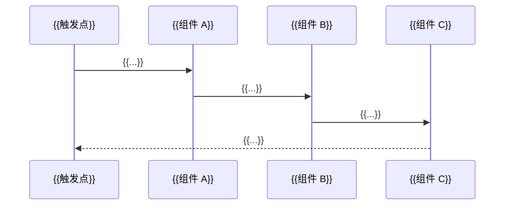

# 开发者 Onboarding 报告：{{项目名称}}

> **语言：** 简体中文（除非用户另有指定）  
> **仓库：** {{仓库 URL}}  
> **提取日期：** {{日期}}  
> **模式：** {{快速|标准|深度}}  
> **证据状态：** {{已执行命令 / 仅文档 / 混合}}

一段式技术摘要：

{{技术摘要}}

---

## 1. 问题域与边界

### 问题陈述

{{解决什么问题}}

### 角色（Persona）

| 角色 | 目标 | 主要界面 |
|------|------|----------|
| {{...}} | {{...}} | {{CLI / API / UI}} |

### 核心用例

1. {{happy path 1}}
2. {{happy path 2}}
3. {{happy path 3}}

### 范围内

- {{...}}

### 范围外

- {{...}}

### 成功指标（若文档有记载）

- {{延迟 / 可靠性 / 安全 / ...}}

**证据：** {{文件路径或文档链接}}

---

## 2. 系统上下文

### 上下文图

```mermaid
graph TB
  User[{{用户角色}}]
  System[{{项目名称}}]
  Ext1[{{外部系统 1}}]
  Ext2[{{外部系统 2}}]
  User --> System
  System --> Ext1
  System --> Ext2
```

### 容器 / 可部署单元

| 单元 | 技术栈 | 职责 | 协议 / 端口 |
|------|--------|------|-------------|
| {{名称}} | {{语言/框架}} | {{...}} | {{...}} |

### 外部依赖

| 依赖 | 用途 | 运行时必需？ |
|------|------|--------------|
| {{...}} | {{...}} | {{是/否}} |

**证据：** {{路径}}

---

## 3. 主执行链路

### 触发点

{{例如：HTTP POST /v1/chat、CLI 命令 `app run`、Kafka topic `events`}}

### 分步说明（含代码锚点）

| 步骤 | 发生什么 | 位置 |
|------|----------|------|
| 1 | {{...}} | `{{path}}` — `{{function}}` |
| 2 | {{...}} | `{{path}}` |
| 3 | {{...}} | `{{path}}` |
| 4 | {{...}} | `{{path}}` |
| 5 | {{...}} | `{{path}}` |
| 6 | {{...}} | `{{path}}` |

### 时序图



### 改动影响指南

- 修改**入站 / 路由**：从 `{{path}}` 开始
- 修改**核心行为**：从 `{{path}}` 开始
- 修改**持久化**：从 `{{path}}` 开始

**证据：** {{路径}}

---

## 4. 架构原则与约束

### 文档化规则

- {{原则 1 — 引用文档}}
- {{原则 2}}
- {{原则 3}}

### 依赖方向

{{谁可以 import 谁；公开包 vs 内部包}}

### 公开 API vs 内部

| 表面 | 位置 | 稳定性 |
|------|------|--------|
| {{公开 SDK}} | `{{path}}` | {{semver / 不稳定}} |
| {{内部}} | `{{path}}` | {{仅内部}} |

**证据：** {{路径}}

---

## 5. 代码地图（按能力）

| 能力 | 入口 | 关键符号 | 测试 | 描述 |
|------|------|----------|------|------|
| {{启动}} | `{{path}}` | {{...}} | `{{path}}` | {{一行}} |
| {{核心服务}} | `{{path}}` | {{...}} | `{{path}}` | {{一行}} |
| {{主链路枢纽}} | `{{path}}` | {{...}} | `{{path}}` | {{一行}} |
| {{配置}} | `{{path}}` | {{...}} | `{{path}}` | {{一行}} |
| {{扩展}} | `{{path}}` | {{...}} | `{{path}}` | {{一行}} |

---

## 6. 配置与状态

### 配置来源（优先级）

```
{{环境变量}} > {{配置文件}} > {{默认值}}
```

### 重要配置键

| 键 / 环境变量 | 用途 | 必填？ |
|---------------|------|--------|
| {{...}} | {{...}} | {{是/否}} |

### 持久化状态

| 状态 | 位置 | 备注 |
|------|------|------|
| {{...}} | `{{路径或 DB}}` | {{...}} |

### 密钥

{{凭据如何存放；切勿粘贴真实密钥}}

### 迁移 / 升级

{{升级命令或文档}}

**证据：** {{路径}}

---

## 7. 构建、运行、调试

### 环境要求

- {{运行时版本}}
- {{系统依赖}}

### 命令

```bash
# 安装
{{INSTALL_CMD}}

# 构建
{{BUILD_CMD}}

# 运行（开发）
{{RUN_CMD}}

# Smoke / 最小 repro
{{SMOKE_CMD}}
```

### 已执行的验证

| 命令 | 结果 |
|------|------|
| {{...}} | {{通过 / 未执行：原因}} |

### 日志与调试

- {{日志位置}}
- {{verbose 开关}}
- {{排障文档链接}}

**证据：** {{路径}}

---

## 8. 测试与质量门禁

| 门禁 | 命令 | 何时 |
|------|------|------|
| 单元 | `{{...}}` | {{本地 / CI}} |
| 集成 | `{{...}}` | {{...}} |
| Lint | `{{...}}` | {{...}} |
| Format | `{{...}}` | {{...}} |
| 类型检查 | `{{...}}` | {{...}} |

### PR 前最低要求

{{从 CONTRIBUTING 复制或推断的检查清单}}

**证据：** {{CI 配置路径}}

---

## 9. 扩展与贡献模型

### 扩展模型（若适用）

{{plugin / hook / module — 或 不适用}}

### 添加最小扩展

1. {{步骤}}
2. {{步骤}}
3. {{步骤}}

### 贡献流程

1. {{issue / fork / branch}}
2. {{所需测试}}
3. {{PR / review / CODEOWNERS}}

**证据：** {{CONTRIBUTING 路径}}

---

## 10. 演进与地雷

| 区域 | 风险 | 更安全路径 | 证据 |
|------|------|------------|------|
| {{遗留模块}} | {{...}} | {{...}} | `{{path}}` |
| {{文档漂移}} | {{...}} | {{以代码/文档为准}} | {{...}} |

### 近期方向（来自 CHANGELOG/docs）

- {{...}}

### 开放问题 / 未验证

- {{...}}

---

## 必读 10 文件

| # | 文件 | 理由 |
|---|------|------|
| 1 | `{{path}}` | {{...}} |
| 2 | `{{path}}` | {{...}} |
| 3 | `{{path}}` | {{...}} |
| 4 | `{{path}}` | {{...}} |
| 5 | `{{path}}` | {{...}} |
| 6 | `{{path}}` | {{...}} |
| 7 | `{{path}}` | {{...}} |
| 8 | `{{path}}` | {{...}} |
| 9 | `{{path}}` | {{...}} |
| 10 | `{{path}}` | {{...}} |

---

## 开发者理解检查清单

阅读本报告后，开发者应能够：

- [ ] 60 秒内画出系统上下文
- [ ] 说出主执行链路上 ≥6 个步骤
- [ ] 定位修改 {{入站 / 核心 / 持久化}} 应从哪入手
- [ ] 本地执行安装 + smoke 命令
- [ ] 运行与主链路相关的一条窄测试
- [ ] 说出 2 条不可违反的架构规则
- [ ] 说出 1 处文档化地雷

---

## 建议 Onboarding 议程

### 30 分钟版

| 时间 | 主题 |
|------|------|
| 0–10 分钟 | 第 1～2 节（问题域 + 上下文） |
| 10–22 分钟 | 第 3 节（主链路 walkthrough） |
| 22–30 分钟 | 第 7 节（现场运行）+ Q&A |

### 2 小时版

| 时间 | 主题 |
|------|------|
| 0–20 分钟 | 第 1～2 节 |
| 20–50 分钟 | 第 3 节 IDE 现场追踪 |
| 50–80 分钟 | 第 4～6 节 + 必读 10 文件 |
| 80–110 分钟 | 第 7～8 节动手 |
| 110–120 分钟 | 第 9～10 节 + Q&A |

---

## 附录：提取笔记

{{原始发现、死胡同、未执行命令、文档/代码冲突}}
